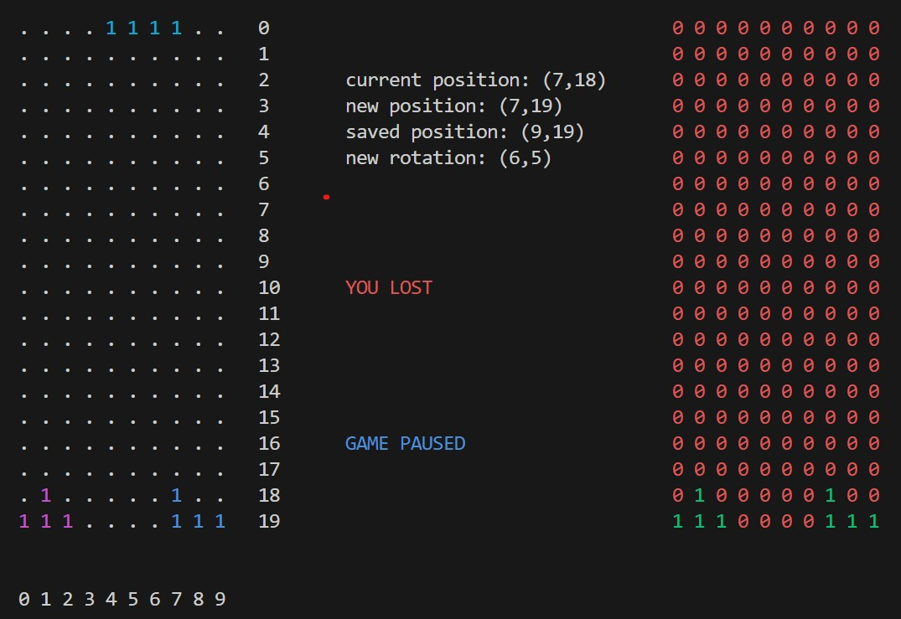

# 🎮 Jeux en terminal avec Python et la bibliothèque Blessed

## Description

Ce projet a pour but de développer une collection de petits jeux jouables directement dans le terminal, en utilisant la bibliothèque **[blessed](https://pypi.org/project/blessed/)** de Python pour gérer l'affichage et les entrées clavier.

## État actuel



* 🎮 **Tetris (en cours de développement)** :
  Un prototype de Tetris fonctionnel à moitié.

  * Le jeu s'affiche dans le terminal.
  * Un **débogueur** intégré affiche l'état de la grille à droite du jeu.
  * Un **panneau de contrôle** montre la position du Tetrimino actif.

## Objectifs

* Finaliser le Tetris (détection de lignes complètes, gestion du Game Over, etc.).
* Ajouter d'autres jeux simples (Snake, Pong, etc.).
* Optimiser l'affichage et les contrôles.

## Prérequis

* Python 3.x
* Bibliothèque `blessed` :

  ```bash
  pip install blessed
  ```

## Lancement

```bash
python tetris.py
```

> Remarque : Le nom du fichier peut changer selon ton implémentation.

## À venir

* Système de score
* Menu de sélection de jeu
* Améliorations graphiques ASCII